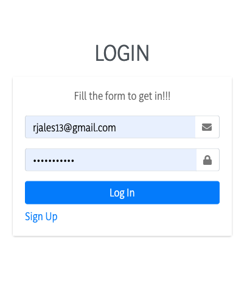
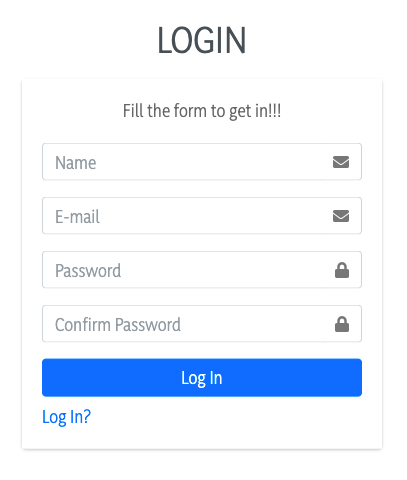

<h1 align="center">
 
Login Authentication using MongoDb + Express + React (Redux) + NodeJs
</h1>

This demonstration will show just a simple login authentication where you will be able to create a new credential and use the same to login later having NODEJS/EXPRESS as the Server and MONGODB as the database

  
  

## Features
- **React Js**
- **Redux**
- **Redux Toaster**
- **Data-Table**
- **Final Form**
- **Node Js**
- **Express**
- **BCrypt**
- **NodeMoon**
- **Pm2**
- **Mongoose**
- **MongoDB**

## Getting started

- open the backend folder and run the command: npm i
- open the frontend folder and run the command: npm i

PS: Both it will install all the necessaries packages

- on the backend folder run the command: npm run dev
- on the frontend folder run the command: npm run start

## NOTES
This app is based on REACT FUNCTIONS and also is using REDUX. Be aware to have installed MONGODB on your local machine!